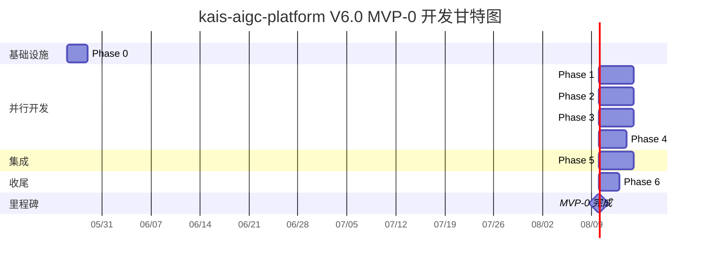
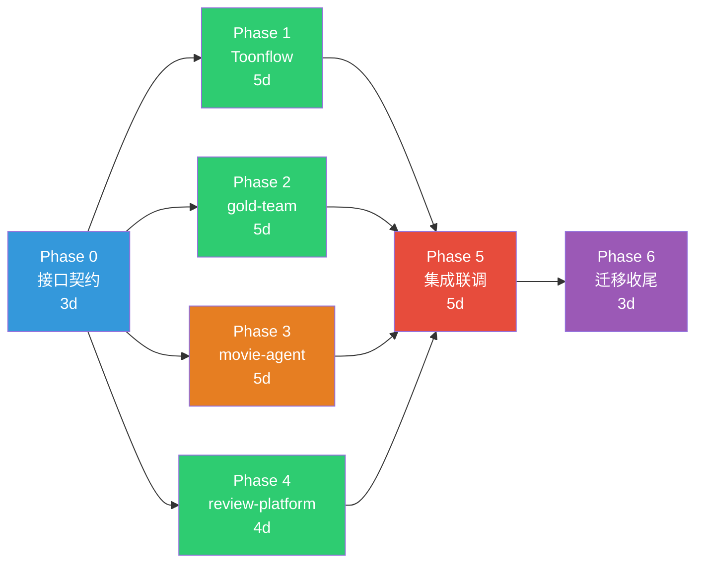

# kais-aigc-platform V6.0 MVP-0 联合开发计划

> **版本**: 1.0  
> **日期**: 2026-05-23  
> **目标**: 定义最小可运行核心链路，制定分阶段开发计划  
> **假设**: 1 个 AI 开发者 (Claude Code) + 1 个人类审核者 (Kai)

---

## 目录

1. [MVP-0 范围定义](#1-mvp-0-范围定义)
2. [分阶段开发计划](#2-分阶段开发计划)
3. [Repo 间协调策略](#3-repo-间协调策略)
4. [技术决策点](#4-技术决策点)
5. [风险和缓解](#5-风险和缓解)
6. [推荐执行顺序（甘特图）](#6-推荐执行顺序甘特图)
7. [人员分配建议](#7-人员分配建议)

---

## 1. MVP-0 范围定义

### 1.1 最小可运行范围

MVP-0 的目标：**端到端跑通一次"用户创建项目 → 生成单个镜头视频 → 人工审核 → 交付"的完整链路**，不追求功能完备，但证明架构可行。

```
用户触发 → Toonflow 画布 → movie-agent 编排 → gold-team 生成 → review 审核 → 交付
```

### 1.2 核心链路功能清单

| 环节 | MVP-0 包含 | MVP-0 不包含 |
|------|-----------|-------------|
| **Toonflow (前端)** | 项目创建、画布节点拖拽、脚本输入、角色定义、场景定义 | EventGraph 可视化编辑、帧级批注、时间线编辑、PWA |
| **core-backend (Jellyfish)** | Canvas Sync API、项目/节点 CRUD、SQLite 持久化、WebSocket 推送 | PostgreSQL 迁移、Redis Pub/Sub、完整认证体系、Asset 绑定 |
| **movie-agent** | 单次管线启动（Phase 4: video）、gold-team 任务提交、回调接收、review 回调处理 | Phase 0-3 跳过、Phase 5-7 延后、Skill Router、Hermes 集成 |
| **gold-team** | Engine Router（本地优先）、ComfyUI Bridge（单模型: Wan2.2 I2V）、V6.0 标准回调、Docker 容器 | 云端降级、Local Engine Pool 生命周期管理、后处理管线 |
| **review-platform** | ShotCard 列表、单卡审批（approve/reject）、回调 movie-agent | 五维评分、PWA 移动端、Merkle 审计、策略引擎、批量操作 |
| **hermes-agent** | **不参与 MVP-0** | 全部延后 |
| **integration** | Docker Compose 全栈编排、健康检查、冒烟测试 | E2E 自动化测试、CI/CD 流水线 |

### 1.3 MVP-0 简化后的核心链路

```
1. 用户在 Toonflow 创建项目，添加 1 个角色 + 1 个场景
2. 用户输入脚本文本，创建 1 个 Shot 节点
3. 用户点击"生成"按钮
4. Toonflow → POST /api/v1/sync/batch → core-backend 存储
5. core-backend → POST http://movie-agent:8001/api/v1/pipeline/run
6. movie-agent 跳过 Phase 0-3，直接执行 Phase 4 (video)
7. movie-agent → POST http://gold-team:8002/api/v1/tasks (image2video)
8. gold-team → ComfyUI API → Wan2.2 I2V 生成视频
9. gold-team → POST http://movie-agent:8001/api/v1/gpu/callback (完成通知)
10. movie-agent → POST http://review-platform:8090/api/v1/reviews (提交审核)
11. 用户在 review-platform 浏览器看到 ShotCard，点击 approve
12. review-platform → POST http://movie-agent:8001/api/v1/reviews/callback
13. movie-agent 推进到 delivery Phase，通知 Toonflow (WebSocket)
14. Toonflow 画布显示生成完成的视频缩略图
```

### 1.4 MVP-0 数据库策略

**推荐: SQLite（开发阶段）→ PostgreSQL（生产）**

MVP-0 使用 SQLite 降低基础设施复杂度：
- core-backend: SQLite（延续 Toonflow 现有 `better-sqlite3`）
- review-platform: SQLite（开发阶段用 SQLAlchemy async + aiosqlite）
- gold-team: Redis Streams（已有）+ 无需持久化
- movie-agent: 无数据库，状态存内存 + 文件系统

SQLite → PostgreSQL 迁移路径：SQLAlchemy 抽象层已存在，切换仅改连接字符串。

---

## 2. 分阶段开发计划

### Phase 0: 基础设施与接口契约 (3 天)

**目标**: 搭建 Docker Compose 骨架，定义所有 API 契约

| 任务 | Repo | 文件/模块 | 工时 |
|------|------|-----------|------|
| 创建 `kais-aigc-integration` Docker Compose 编排 | integration | `docker-compose.yml`, `docker-compose.dev.yml` | 0.5d |
| 定义 OpenAPI spec: core-backend Canvas Sync API | integration | `specs/core-backend.openapi.yaml` | 0.5d |
| 定义 OpenAPI spec: movie-agent Pipeline API | integration | `specs/movie-agent.openapi.yaml` | 0.5d |
| 定义 OpenAPI spec: gold-team Task API | integration | `specs/gold-team.openapi.yaml` | 0.5d |
| 定义 OpenAPI spec: review-platform Review API | integration | `specs/review-platform.openapi.yaml` | 0.5d |
| 定义 V6.0 统一回调格式 JSON Schema | integration | `specs/callback-schema.json` | 0.5d |
| 各 repo 创建 mock server（基于 OpenAPI spec） | 各 repo | `tests/mocks/` | 1d |

**依赖**: 无  
**验收标准**:
- ✅ 4 个 OpenAPI spec 文件通过 `spectral lint` 校验
- ✅ `docker-compose up` 能启动所有服务（健康检查通过）
- ✅ 各服务 mock 端点返回符合 spec 的响应

**并行可能性**: OpenAPI spec 定义可并行（4 个 spec 独立编写）

---

### Phase 1: Toonflow + core-backend 对接 (5 天)

**目标**: 用户能在 Toonflow 画布上创建项目，数据同步到 core-backend

#### 1A: core-backend 最小实现 (3 天)

| 任务 | Repo | 文件/模块 | 工时 |
|------|------|-----------|------|
| Express 后端路由: 项目 CRUD | Toonflow (src/) | `src/routes/project/` (已有，需对齐 V6.0 Schema) | 1d |
| Canvas Sync API: POST /sync/batch | Toonflow (src/) | `src/routes/sync/batch.ts` (新建) | 1d |
| Canvas Sync API: POST /sync/pull | Toonflow (src/) | `src/routes/sync/pull.ts` (新建) | 0.5d |
| WebSocket 推送: 状态变更通知 | Toonflow (src/) | `src/socket/index.ts` (改造) | 0.5d |

#### 1B: Toonflow 前端改造 (2 天)

| 任务 | Repo | 文件/模块 | 工时 |
|------|------|-----------|------|
| "生成"按钮 → 触发管线启动 | Toonflow (前端) | 画布 UI 组件 | 1d |
| 生成状态轮询 → 画布节点状态更新 | Toonflow (前端) | 节点状态渲染逻辑 | 0.5d |
| 视频缩略图预览（代理文件） | Toonflow (前端) | 节点预览组件 | 0.5d |

**关键决策**: MVP-0 中 Toonflow 的 Express 后端就是 core-backend，**不拆分**。Toonflow 已有完整的 Express + SQLite + Socket.IO 后端，直接在现有代码基础上新增 Canvas Sync API 和管线触发接口。

**依赖**: Phase 0 (OpenAPI spec)  
**验收标准**:
- ✅ 用户创建项目 → SQLite 写入成功
- ✅ 用户创建角色/场景/Shot 节点 → 数据持久化
- ✅ 点击"生成" → POST /api/v1/pipeline/run 发送成功
- ✅ WebSocket 收到状态变更 → 画布节点状态更新

**并行可能性**: 1A 和 1B 可部分并行（后端 API 先行，前端对接 API）

---

### Phase 2: gold-team 单引擎生成 (5 天)

**目标**: gold-team 能接收任务，通过 ComfyUI 生成视频，回调通知

| 任务 | Repo | 文件/模块 | 工时 |
|------|------|-----------|------|
| FastAPI 统一 API Server | gold-team | `src/api_server.py` | 1d |
| Engine Router（简化版: 仅本地） | gold-team | `src/engine_router.py` | 1d |
| ComfyUI Bridge: Wan2.2 I2V | gold-team | `src/comfyui_bridge.py` | 2d |
| V6.0 标准回调格式 | gold-team | `src/callback_standard.py` | 0.5d |
| Docker Compose 服务定义 | gold-team | `Dockerfile`, `docker-compose.yml` | 0.5d |

**依赖**: Phase 0 (OpenAPI spec)  
**验收标准**:
- ✅ `POST /api/v1/tasks` 提交 image2video 任务 → 返回 task_id
- ✅ ComfyUI 执行 Wan2.2 I2V → 生成 .mp4 文件
- ✅ 回调 POST callback_url → V6.0 标准格式 JSON
- ✅ `GET /api/v1/tasks/{id}` 查询任务状态正确
- ✅ `GET /health` 健康检查通过

**并行可能性**: **完全并行于 Phase 1**（用 mock callback_url 解耦）

---

### Phase 3: movie-agent 管线编排 (5 天)

**目标**: movie-agent 能接收管线请求，编排 gold-team 任务，处理回调

| 任务 | Repo | 文件/模块 | 工时 |
|------|------|-----------|------|
| `server.js` 骨架: node:http REST 服务 | movie-agent | `server.js` | 1d |
| Pipeline 状态机（简化: 仅 video Phase） | movie-agent | `lib/pipeline.js` | 1d |
| gold-team 客户端 | movie-agent | `lib/gold-team-client.js` | 1d |
| review-platform 客户端 | movie-agent | `lib/review-platform-client.js` | 1d |
| GPU 回调处理 + 审核回调处理 | movie-agent | `lib/callbacks.js` | 0.5d |
| Docker Compose 服务定义 | movie-agent | `Dockerfile`, `docker-compose.yml` | 0.5d |

**依赖**: Phase 0 (OpenAPI spec) + Phase 2 (gold-team API 可用)  
**验收标准**:
- ✅ `POST /api/v1/pipeline/run` → 返回 pipeline_id + job_id
- ✅ 管线自动提交 gold-team 任务 → 接收回调
- ✅ 回调后自动提交 review-platform 审核
- ✅ `GET /api/v1/pipeline/status` 返回正确状态
- ✅ `GET /health` 健康检查通过

**并行可能性**: 可与 Phase 2 并行开发（用 mock gold-team），集成联调在 Phase 2 完成后

---

### Phase 4: review-platform 最小审核 (4 天)

**目标**: 用户能在浏览器中查看生成结果并审批

| 任务 | Repo | 文件/模块 | 工时 |
|------|------|-----------|------|
| ShotCard 列表页面 | review-platform | `app/templates/shots/list.html` + `app/api/v1/shots.py` | 1d |
| ShotCard 详情页（视频预览 + approve/reject） | review-platform | `app/templates/shots/detail.html` + `app/api/v1/reviews.py` | 1d |
| 审核 API: approve/reject + 回调 movie-agent | review-platform | `app/api/v1/reviews.py` + `app/services/callback_service.py` | 1d |
| SQLite 模式适配 | review-platform | `app/core/database.py` | 0.5d |
| Docker Compose 服务定义 | review-platform | `Dockerfile`, `docker-compose.yml` | 0.5d |

**依赖**: Phase 0 (OpenAPI spec)  
**验收标准**:
- ✅ ShotCard 列表显示待审核项
- ✅ 点击 ShotCard → 视频预览播放
- ✅ 点击 Approve → 回调 movie-agent → 管线推进
- ✅ 点击 Reject → 回调 movie-agent → 管线暂停
- ✅ `GET /health` 健康检查通过

**并行可能性**: **完全并行于 Phase 2/3**（用 mock 数据开发前端）

---

### Phase 5: 全栈集成联调 (5 天)

**目标**: 端到端跑通完整链路

| 任务 | Repo | 文件/模块 | 工时 |
|------|------|-----------|------|
| Docker Compose 全栈编排 | integration | `docker-compose.yml` (更新) | 0.5d |
| 集成测试: 管线启动 → 生成 → 审核 | integration | `tests/test_e2e_pipeline.py` | 1d |
| Toonflow ↔ core-backend 数据同步验证 | integration | `tests/test_sync.py` | 0.5d |
| movie-agent ↔ gold-team 回调链验证 | integration | `tests/test_callback_chain.py` | 1d |
| review-platform ↔ movie-agent 审核流验证 | integration | `tests/test_review_flow.py` | 0.5d |
| ffmpeg 代理文件生成验证 | integration | `tests/test_proxy_files.py` | 0.5d |
| Bug 修复 + 稳定性调优 | 全栈 | — | 1d |

**依赖**: Phase 1 + Phase 2 + Phase 3 + Phase 4  
**验收标准**:
- ✅ 端到端: 创建项目 → 生成视频 → 人工审核 → 交付（全链路通过）
- ✅ 生成视频时长 ≥ 3 秒，分辨率 ≥ 720p
- ✅ 回调链无丢失（task callback → review callback → status update）
- ✅ 代理文件（thumbnail + proxy）正确生成
- ✅ Docker Compose 一键启动 → 30s 内所有服务健康

---

### Phase 6: 集成迁移与收尾 (3 天)

**目标**: 将 kais-aigc-integration 的 4 个模块代码迁移到目标 repo

| 任务 | Repo | 工时 |
|------|------|------|
| gold-team-control → core-backend 迁移 | integration → Toonflow | 0.5d |
| gold-team-worker → gold-team 迁移（对比合并） | integration → gold-team | 1d |
| movie-agent-integration → movie-agent 迁移 | integration → movie-agent | 0.5d |
| review-platform-extension → review-platform 迁移 | integration → review-platform | 0.5d |
| kais-aigc-integration 重组为纯集成测试项目 | integration | 0.5d |

**依赖**: Phase 5  
**验收标准**:
- ✅ 迁移后全栈功能不变（E2E 测试通过）
- ✅ integration repo 只含 docker-compose + specs + tests
- ✅ 各 repo 独立可构建、可测试

---

## 3. Repo 间协调策略

### 3.1 独立开发 vs 集成联调节奏

```
Week 1: Phase 0 (接口契约) → 各 repo 并行开发 Phase 1-4
Week 2: 继续并行开发
Week 3: Phase 5 (集成联调) → 发现问题 → 各 repo 修复
Week 4: Phase 6 (迁移收尾) → 稳定性验证
```

**节奏**:
- **每日**: 各 repo 独立开发和测试
- **每 2 天**: AI 开发者切换 repo，推进当前最关键路径
- **Phase 5 开始**: 全栈联调，集中解决集成问题

### 3.2 API Contract First 方案

```
1. Phase 0 定义 OpenAPI spec → 推送到 integration/specs/
2. 各 repo 根据 spec 生成 Pydantic/Zod 模型
3. 开发期间严格按 spec 实现接口
4. 集成联调时用 schemathesis 做 contract testing
```

**OpenAPI spec 文件清单**:

| 文件 | 覆盖服务 | 关键端点数 |
|------|---------|-----------|
| `specs/core-backend.openapi.yaml` | Toonflow Express 后端 | ~8 (Canvas Sync + Project CRUD) |
| `specs/movie-agent.openapi.yaml` | kais-movie-agent | ~10 (Pipeline + Callbacks + Health) |
| `specs/gold-team.openapi.yaml` | kais-gold-team | ~6 (Task CRUD + SSE + Health) |
| `specs/review-platform.openapi.yaml` | kais-review-platform | ~8 (ShotCards + Reviews + Callback) |
| `specs/callback-schema.json` | 跨服务 | 3 (GPU Callback + Review Callback + Task Event) |

### 3.3 Mock 策略

| Repo | Mock 对象 | 方式 |
|------|----------|------|
| **Toonflow** | movie-agent | `POST /api/v1/pipeline/run` → 返回固定 pipeline_id，状态立即 complete |
| **movie-agent** | gold-team | `POST /api/v1/tasks` → 延迟 2s 返回 completed callback |
| **movie-agent** | review-platform | `POST /api/v1/reviews` → 延迟 5s 返回 approved callback |
| **gold-team** | ComfyUI | `POST /prompt` → 返回固定视频文件路径（使用预置测试视频） |
| **review-platform** | movie-agent callback | 审批后 POST callback_url → 日志记录，不实际调用 |

**Mock 实现方式**: 各 repo 的 `tests/mocks/` 目录下创建轻量 mock server（Express/FastAPI 均可），Docker Compose 通过 profile 切换 mock/real 服务。

### 3.4 测试策略

| 层级 | 工具 | 运行时机 | 覆盖范围 |
|------|------|---------|---------|
| **单元测试** | pytest (Python) / vitest (Node) | 每次 commit | 各 repo 内部逻辑 |
| **契约测试** | schemathesis | 每日 | API 符合 OpenAPI spec |
| **集成测试** | pytest + docker-compose | Phase 5+ | 服务间通信正确性 |
| **E2E 测试** | Playwright (Toonflow) + HTTP (API) | Phase 5 完成后 | 完整用户流程 |
| **冒烟测试** | curl / httpie | 每次部署 | 各服务 health check |

---

## 4. 技术决策点

### 4.1 Toonflow Express 后端是否拆分为独立 FastAPI 服务？

| 选项 | 优点 | 缺点 | 推荐 |
|------|------|------|------|
| **A. 不拆分，保持 Express** | 零迁移成本；Toonflow 已有完整 Express + SQLite；Electron + Express 天然集成 | Python 生态（gold-team/review-platform）与 Node.js 生态隔离 | ✅ **MVP-0 推荐** |
| **B. 拆分为独立 FastAPI** | 统一 Python 栈；FastAPI async 性能好；可独立部署 | 重写所有 Express 路由（~80+ 路由文件）；Electron 需额外对接；工作量 2-3 周 | ❌ 延后到 V6.1 |
| **C. 混合: Express 保留 + FastAPI sidecar** | 渐进迁移；新功能用 FastAPI | 运维复杂度增加；两套服务端口管理 | ⚠️ 可选 |

**推荐**: MVP-0 选 A，V6.1 评估 B。Toonflow 已有 80+ 路由文件和完整的 Express + Socket.IO 基础设施，重写代价远大于收益。

### 4.2 kais-movie-agent 是否从 OpenClaw Skill 完全迁移为独立服务？

| 选项 | 优点 | 缺点 | 推荐 |
|------|------|------|------|
| **A. 完全独立 Docker 服务** | 独立部署、独立扩缩、标准运维 | 需要重写 OpenClaw agent 调度逻辑 | ✅ **推荐** |
| **B. 保持 OpenClaw Skill + HTTP 入口** | 复用 OpenClaw 基础设施 | 依赖 OpenClaw 运行时；端口冲突风险 | ❌ 不推荐 |
| **C. 渐进: 先 HTTP 入口，后完全独立** | 风险低 | 维护两套入口 | ⚠️ 备选 |

**推荐**: 选 A。movie-agent 的改造方案已明确 REST API + Docker 服务化，OpenClaw Skill 机制在 Docker Compose 环境中不适用。

### 4.3 数据库策略

| 选项 | 优点 | 缺点 | 推荐 |
|------|------|------|------|
| **A. 全 SQLite** | 零基础设施；开发快；本地文件 | 无并发写；不支持跨服务共享 | ✅ **MVP-0 推荐** |
| **B. PostgreSQL** | 生产级；跨服务共享；ACID | 需要数据库容器；Schema 管理 | ⚠️ V6.1 迁移目标 |
| **C. SQLite + PostgreSQL 双模式** | 开发用 SQLite，生产切 PG | 双路径维护成本 | ⚠️ 推荐 SQLAlchemy 抽象层 |

**推荐**: MVP-0 用 A。Toonflow 已用 better-sqlite3，review-platform 已用 SQLAlchemy，切换连接字符串即可。Phase 6 后迁移到 PostgreSQL。

### 4.4 部署策略

| 选项 | 优点 | 缺点 | 推荐 |
|------|------|------|------|
| **A. Docker Compose 单机** | 一键启动；网络隔离；资源限制 | 单机瓶颈 | ✅ **推荐** |
| **B. 保持当前架构** | 无迁移成本 | 双机复杂度；端口冲突 | ❌ 不符合 V6.0 目标 |
| **C. K8s** | 生产级编排 | 过度工程化 | ❌ 远期考虑 |

**推荐**: 选 A。V6.0 架构明确 Docker Compose 单机部署（RTX 3090 + 3060Ti 同一台主机）。

### 4.5 mono-repo vs multi-repo 管理

| 选项 | 优点 | 缺点 | 推荐 |
|------|------|------|------|
| **A. multi-repo（当前模式）** | 各 repo 独立版本；职责清晰 | 跨 repo 协调成本；集成测试复杂 | ✅ **保持** |
| **B. mono-repo** | 统一版本；原子提交；共享 CI | 仓库体积大；权限粒度粗 | ❌ 不切换 |

**推荐**: 保持 multi-repo。已有独立 repo 结构（kais-aigc-platform/gold-team/movie-agent/review-platform/integration），切换成本高收益低。`kais-aigc-integration` 作为协调层负责跨 repo 编排和测试。

---

## 5. 风险和缓解

### 5.1 高风险

| # | 风险 | 影响 | 概率 | 缓解措施 |
|---|------|------|------|---------|
| R1 | **ComfyUI API 不稳定 / Wan2.2 模型加载失败** | gold-team 无法生成视频，核心链路断裂 | 中 | ① 预置测试视频作为 fallback ② 提前在裸机环境验证 ComfyUI + Wan2.2 ③ 云端 API (可灵) 作为 Plan B |
| R2 | **Toonflow Electron + Docker 网络互通问题** | 前端无法调用 Docker 内服务 | 中 | ① 开发阶段用 host 网络模式 ② 生产用 Tailscale VPN ③ 备选: Toonflow 直接访问 localhost 映射端口 |
| R3 | **movie-agent 从 OpenClaw Skill 迁移风险** | 核心管线逻辑丢失或行为变更 | 中 | ① Pipeline 类保持库模式不变 ② 逐阶段验证: 先 Phase 4 通过再扩展 ③ 保留 OpenClaw Skill 作为回退路径 |

### 5.2 中风险

| # | 风险 | 影响 | 概率 | 缓解措施 |
|---|------|------|------|---------|
| R4 | **跨服务回调丢失** | 管线卡住在某阶段 | 中 | ① 所有回调带重试（3 次，指数退避） ② movie-agent 定时超时检查（2h 无回调 → 查询状态） ③ 关键回调写日志 + 持久化 |
| R5 | **gold-team 现有代码与改造方案冲突** | 改造过程中引入回归 | 低中 | ① 改造前完整备份 ② 新建 `src/` 目录与旧代码隔离 ③ 渐进迁移，不一步到位 |
| R6 | **SQLite 并发限制** | 多服务同时写同一 DB | 低 | MVP-0 只有 core-backend 写 DB，review-platform 只读或独立 SQLite 文件 |

### 5.3 低风险

| # | 风险 | 影响 | 概率 | 缓解措施 |
|---|------|------|------|---------|
| R7 | **ffmpeg 代理文件生成失败** | 无缩略图/代理视频，不影响核心生成 | 低 | 预置默认占位图；ffmpeg 命令提前在裸机验证 |
| R8 | **Docker Compose 服务启动顺序问题** | 依赖服务未就绪导致连接失败 | 低 | healthcheck + depends_on + retry 策略 |

---

## 6. 推荐执行顺序（甘特图）



**关键路径**: Phase 0 → Phase 3 (movie-agent) → Phase 5 (集成联调) → Phase 6

**总预估**: 30 天（含缓冲），约 6 周（按 5 天/周计算）

### 并行关系图



---

## 7. 人员分配建议

### 7.1 角色分工

| 角色 | 职责 | 时间分配 |
|------|------|----------|
| **AI 开发者 (Claude Code)** | 代码编写、测试、调试、文档 | 100% (全职) |
| **人类审核者 (Kai)** | 技术决策审批、代码审查、E2E 验收、ComfyUI 环境配置 | ~2h/天 |

### 7.2 AI 开发者每日节奏

```
09:00 - 09:30  拉取最新代码，检查 CI 状态
09:30 - 12:00  核心开发（当前 Phase 的主要任务）
13:30 - 15:00  继续开发 / 跨 repo 集成工作
15:00 - 16:00  编写/运行测试，修复 bug
16:00 - 16:30  更新文档，提交 PR
16:30 - 17:00  准备次日工作计划
```

### 7.3 Repo 切换策略

由于只有 1 个 AI 开发者，需要高效切换 repo。推荐节奏：

| 天数 | 工作 Repo | 具体任务 |
|------|-----------|----------|
| D1-D3 | integration | Phase 0: OpenAPI spec + Docker Compose 骨架 |
| D4-D5 | gold-team | Phase 2: API Server + ComfyUI Bridge 骨架 |
| D6-D7 | movie-agent | Phase 3: server.js + Pipeline 状态机 |
| D8-D10 | Toonflow | Phase 1: Canvas Sync API + 前端对接 |
| D11-D12 | review-platform | Phase 4: ShotCard 审核页面 |
| D13 | gold-team | Phase 2: ComfyUI Bridge 完成 + 回调 |
| D14 | movie-agent | Phase 3: 集成 gold-team + review 客户端 |
| D15-D19 | integration | Phase 5: 全栈集成联调 |
| D20-D22 | 各 repo | Phase 6: 迁移收尾 |
| D23-D25 | 全栈 | Bug 修复 + 稳定性验证（缓冲） |

### 7.4 人类审核者参与节点

| 节点 | 参与方式 | 预计时间 |
|------|---------|----------|
| Phase 0 完成 | 审查 OpenAPI spec，确认接口设计 | 1h |
| Phase 2 完成 | 验证 ComfyUI 环境可用（GPU + 模型） | 2h |
| Phase 5 启动 | 参与首次端到端测试 | 2h |
| Phase 5 进行中 | 浏览器验收 review-platform 审核 UI | 1h |
| MVP-0 完成 | 最终验收 + 技术决策讨论 | 2h |

### 7.5 效率最大化建议

1. **API 契约先行**: Phase 0 的 OpenAPI spec 必须准确，后续所有 repo 基于它开发，避免返工
2. **Mock 解耦**: 各 repo 开发期间用 mock server，不等待其他 repo 完成
3. **增量提交**: 每完成一个模块就提交，方便代码审查和回滚
4. **ComfyUI 提前验证**: 人类审核者在 Phase 0-1 期间验证 ComfyUI + Wan2.2 环境，不阻塞开发
5. **Docker 镜像缓存**: 各 repo Dockerfile 优先缓存依赖层，加速构建
6. **日志统一**: 所有服务使用结构化 JSON 日志，方便集成联调时排查问题

---

## 附录

### A. MVP-0 后续路线图

```
MVP-0 (6 周)        → 端到端单镜头生成+审核
MVP-1 (+4 周)       → Phase 0-3 (剧本/角色/分镜) + 云端降级
MVP-2 (+4 周)       → 完整 8 Phase 管线 + 五维评分 + 移动端
V6.0 Release (+4 周) → Hermes 集成 + PostgreSQL 迁移 + 生产级部署
```

### B. Repo 地址清单

| Repo | GitHub | 技术栈 | 端口 |
|------|--------|--------|------|
| kais-aigc-platform (Toonflow) | kaiger666888/kais-aigc-platform | Electron + Express + SQLite | 3000 (dev) |
| kais-gold-team | kaiger666888/kais-gold-team | Python FastAPI + Redis | 8002 |
| kais-movie-agent | kaiger666888/kais-movie-agent | Node.js (零依赖) | 8001 |
| kais-review-platform | kaiger666888/kais-review-platform | FastAPI + HTMX + Alpine.js | 8090 |
| hermes-worker-agent | kaiger666888/hermes-worker-agent | Node.js + OpenAI SDK | 8003 (V6.1) |
| kais-aigc-integration | kaiger666888/kais-aigc-integration | Docker Compose + Tests | — |

### C. 工作量汇总

| Phase | 天数 | 占比 | 关键产出 |
|-------|------|------|----------|
| Phase 0: 接口契约 | 3d | 10% | OpenAPI spec × 4 + Docker Compose 骨架 |
| Phase 1: Toonflow | 5d | 17% | Canvas Sync API + 前端对接 |
| Phase 2: gold-team | 5d | 17% | FastAPI + ComfyUI Bridge + 回调 |
| Phase 3: movie-agent | 5d | 17% | REST 服务 + 管线状态机 + 客户端 |
| Phase 4: review-platform | 4d | 13% | ShotCard 审核页面 + 回调 |
| Phase 5: 集成联调 | 5d | 17% | E2E 测试 + Bug 修复 |
| Phase 6: 迁移收尾 | 3d | 10% | integration 模块迁移 + 清理 |
| **合计** | **30d** | **100%** | **端到端可运行 MVP-0** |