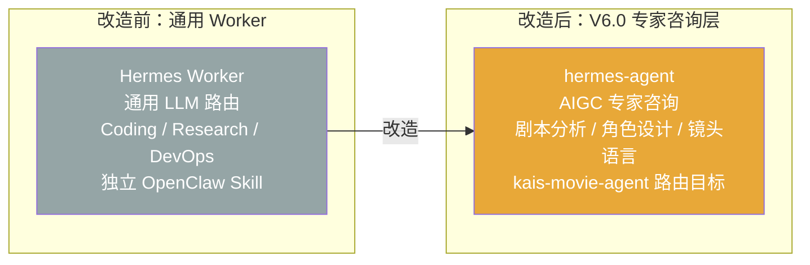
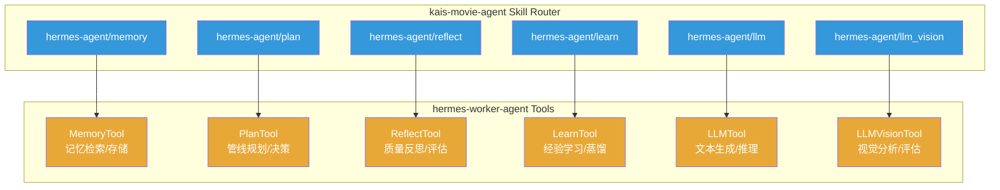
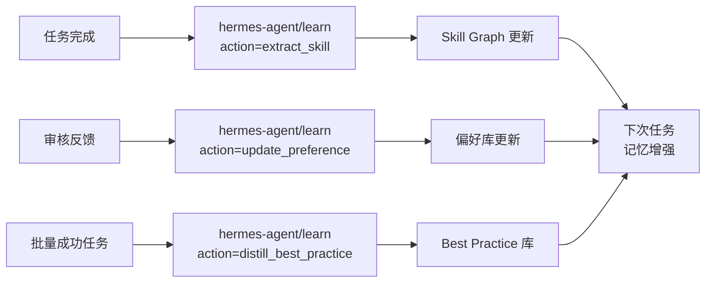
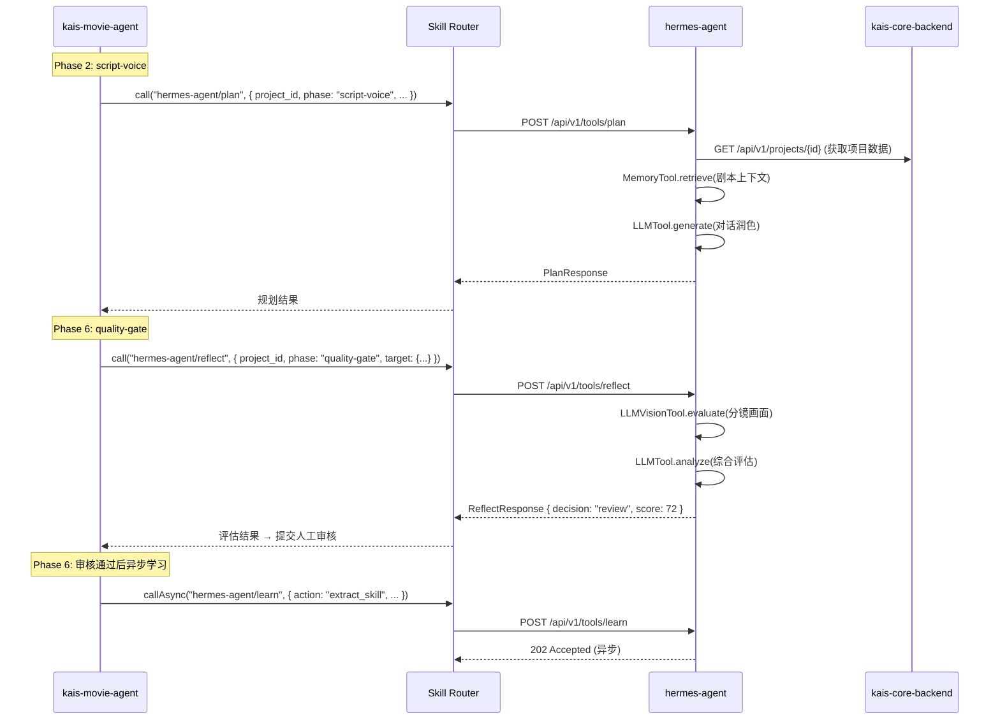
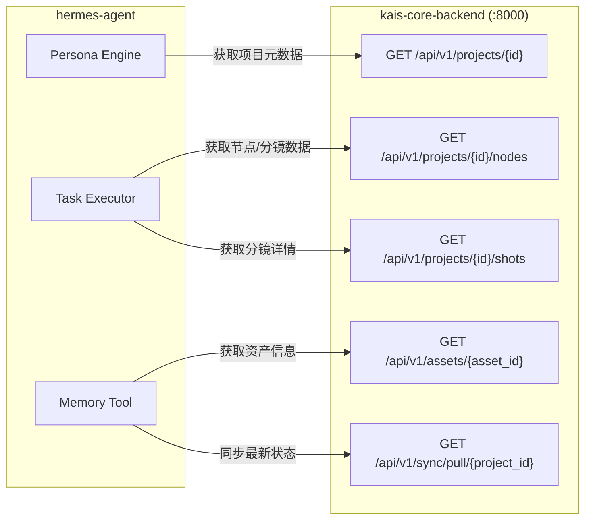
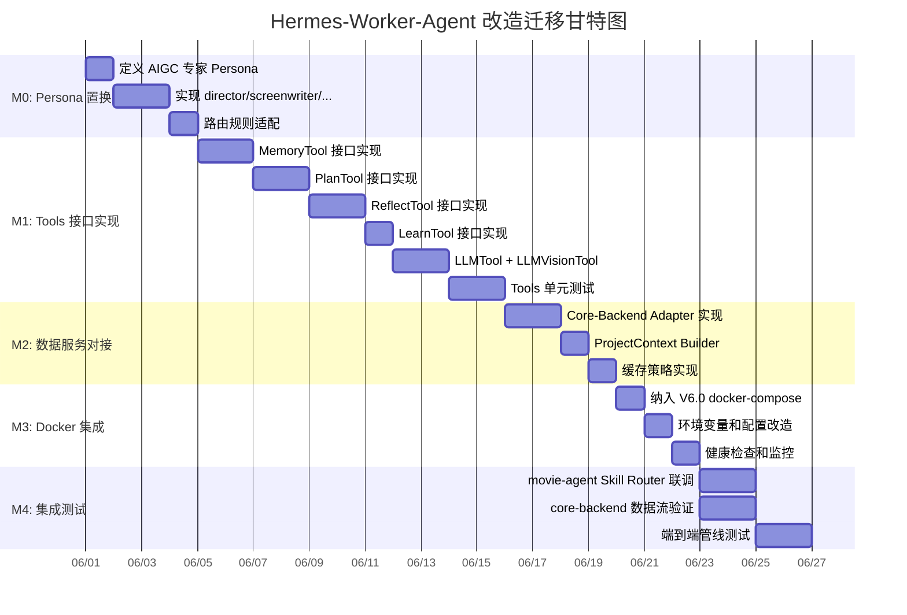
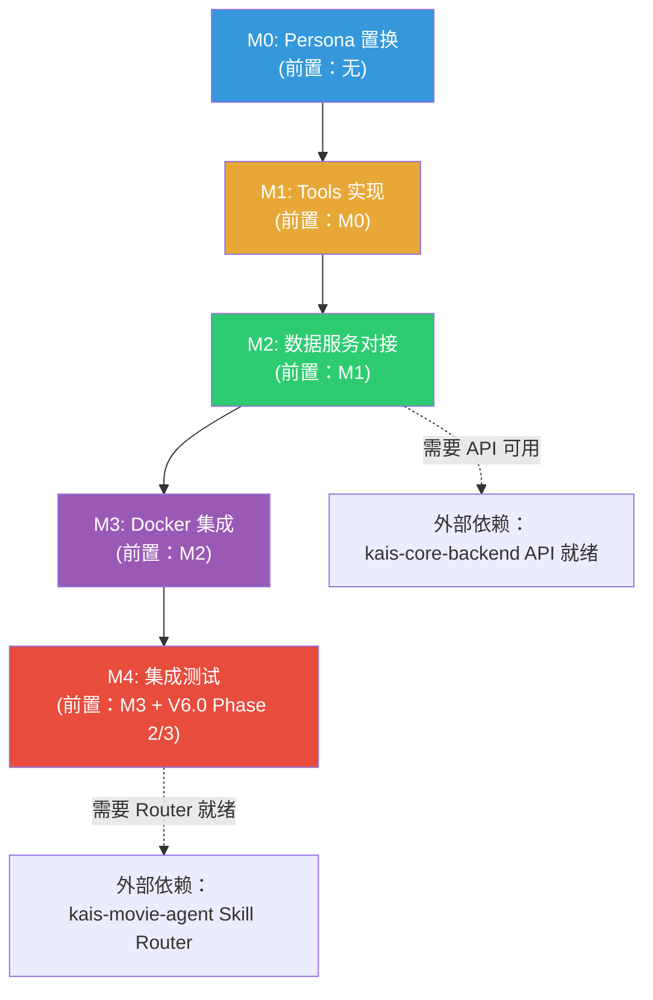

# Hermes Worker Agent — V6.0 架构改造文档

> **版本**: 1.0  
> **日期**: 2026-05-23  
> **基于**: V6.0 Final Architecture (`docs/architecture.md`)  
> **目标项目**: `hermes-worker-agent`  
> **仓库位置**: `~/.openclaw/workspace/hermes-worker-agent/`

---

## 目录

1. [改造目标](#1-改造目标)
2. [角色定位：专家咨询层](#2-角色定位专家咨询层)
3. [功能增强：6 个 Tools 接口对齐](#3-功能增强6-个-tools-接口对齐)
4. [与 kais-movie-agent 的集成方式](#4-与-kais-movie-agent-的集成方式)
5. [与 kais-core-backend 的数据服务接口](#5-与-kais-core-backend-的数据服务接口)
6. [Docker 部署方案](#6-docker-部署方案)
7. [迁移步骤和依赖关系](#7-迁移步骤和依赖关系)

---

## 1. 改造目标

### 1.1 核心改造：从通用 LLM 路由到 V6.0 专家咨询层

当前 Hermes 是一个**通用 LLM Worker Agent**，职责涵盖 Coding、Research、DevOps、AUTOSAR、文档分析等多种任务类型。V6.0 架构要求将其改造为 **AIGC 平台的专家咨询层**，专职服务于 `kais-movie-agent` 的管线编排需求。



### 1.2 改造原则

| # | 原则 | 说明 |
|---|------|------|
| 1 | **保留核心运行时** | Persona Engine、Task Executor、Memory System、Dynamic Router 的架构保持不变 |
| 2 | **Persona 置换** | 将通用 Persona（coder/researcher/devops）替换为 AIGC 专家 Persona |
| 3 | **接口对齐** | 6 个 tools 的接口签名和语义与 kais-movie-agent Skill Router 对齐 |
| 4 | **容器级集成** | 从独立 OpenClaw Skill 转为 Docker Compose 内的微服务，通过 REST 通信 |
| 5 | **数据服务对接** | 通过 kais-core-backend 的 REST API 获取项目数据、资产、分镜信息 |

### 1.3 改造范围概览

| 模块 | 当前状态 | 改造目标 | 改造力度 |
|------|---------|---------|---------|
| Persona Engine | coder/researcher 通用 Persona | AIGC 专家 Persona（director/screenwriter/cinematographer） | **重写** |
| Task Router | 基于关键词的简单路由 | 基于电影创作领域知识的专业路由 | **重写** |
| Task Executor | 通用 LLM 调用 + memory 增强 | 面向 AIGC 管线的结构化输出 | **增强** |
| MCP Bridge | 通用工具发现 | 对接 6 个标准 tools | **改造** |
| Storage (SQLite) | tasks/executions 通用表 | 增加 AIGC 专用表和字段 | **扩展** |
| API Server | `/api/v1/tasks` 通用提交 | 增加专家咨询专用端点 | **扩展** |
| Config | `hermes.config.yaml` 通用配置 | AIGC 专家配置 + movie-agent 集成 | **改造** |
| Docker | 独立 docker-compose（hermes + redis） | 纳入 V6.0 统一 docker-compose | **改造** |

---

## 2. 角色定位：专家咨询层

### 2.1 在 V6.0 架构中的位置

在 V6.0 系统全景图中，hermes-agent 定位于 **kais-movie-agent Skill Router 的专家咨询路由目标**：

```
kais-movie-agent (调度中枢)
├── PHASE 0~7 状态机
├── Skill Router
│   ├── toonflow/*         → Toonflow Desktop (画布操作)
│   ├── jellyfish/*        → kais-core-backend (数据服务)
│   ├── hermes-agent/*     → hermes-worker-agent (专家咨询)  ← 本项目
│   └── gold-team/generate → kais-gold-team (统一生成)
└── 质量闸门
```

### 2.2 专家咨询职责

hermes-agent 在 PHASE 0~7 中承担**高认知、非生成类**任务：

| PHASE | 咨询场景 | 路由路径 | 产出 |
|-------|---------|---------|------|
| **Phase 0 (requirement)** | 受众分析、题材生成、剧本创意评估 | `hermes-agent/audience-analyze` | 受众画像 JSON |
| **Phase 0 (requirement)** | 故事大纲生成、叙事弧线评估 | `hermes-agent/story-outline` | 故事大纲 + 叙事弧线评分 |
| **Phase 2 (script-voice)** | 对话润色、台词情感标注、story-score 分析 | `hermes-agent/script-polish` | 润色后台词 + 情感标注 |
| **Phase 3 (storyboard)** | 镜头语言建议、构图推荐、运镜方案 | `hermes-agent/camera-advice` | 镜头方案 JSON |
| **Phase 6 (quality-gate)** | AI 质量评估、五维评分、一致性检查 | `hermes-agent/quality-evaluate` | 五维评分 + 改进建议 |
| **跨 Phase** | 角色性格一致性、视觉风格建议 | `hermes-agent/style-consult` | 风格参考 + 参数建议 |

### 2.3 边界：hermes-agent 不做什么

| 不做 | 原因 | 由谁做 |
|------|------|--------|
| 直接调用 GPU 推理 | 3090 显存资源由 gold-team 独占 | kais-gold-team |
| 直接操作画布节点 | 画布状态由 Toonflow 本地管理 | Toonflow Desktop |
| 直接读写数据库 | 数据一致性由 core-backend 保证 | kais-core-backend |
| 直接触发云端 API | 生成任务路由由 gold-team 统一管理 | kais-gold-team |
| 直接发送 Telegram 通知 | 通知由 movie-agent 统一管理 | kais-movie-agent |

---

## 3. 功能增强：6 个 Tools 接口对齐

### 3.1 Tools 总览

hermes-agent 对外暴露 6 个标准 tools，与 kais-movie-agent Skill Router 的 `hermes-agent/*` 路由一一对应：



### 3.2 Tool 1: MemoryTool（`hermes-agent/memory`）

**职责**：项目级记忆检索和存储，支持跨 Phase 的上下文延续。

**接口定义**：

```typescript
// POST /api/v1/tools/memory
interface MemoryRequest {
  action: "store" | "retrieve" | "search" | "consolidate";
  project_id: string;
  phase?: PhaseId;                // "requirement" | "art-character" | ... | "delivery"
  query?: string;                 // for retrieve/search
  content?: {                     // for store
    type: "insight" | "decision" | "preference" | "constraint" | "evaluation";
    text: string;
    metadata?: Record<string, unknown>;
    tags?: string[];
  };
  options?: {
    topK?: number;                // 默认 5
    threshold?: number;           // 默认 0.7
    includeGraph?: boolean;       // 是否包含关联图谱
  };
}

interface MemoryResponse {
  action: string;
  results?: Array<{
    id: string;
    content: string;
    type: string;
    score: number;
    phase: string;
    created_at: string;
    related_nodes?: string[];     // 图谱关联节点
  }>;
  stored_id?: string;
  consolidated_count?: number;
}
```

**数据流**：

```
movie-agent (PHASE 切换)
  → hermes-agent/memory?action=retrieve&project_id=xxx&phase=script-voice
  → 返回 Phase 0~1 的决策和偏好
  → 用于剧本润色时的上下文增强
```

**存储映射**：

| Memory 内容类型 | 存储位置 | 说明 |
|----------------|---------|------|
| insight（洞察） | SQLite `memories` 表 + 向量索引 | 项目级创作洞察 |
| decision（决策） | SQLite `memories` 表 + JSON Graph | 关键决策节点 |
| preference（偏好） | SQLite `preferences` 表 | 用户风格偏好 |
| constraint（约束） | SQLite `constraints` 表 | 创作约束条件 |
| evaluation（评估） | SQLite `evaluations` 表 + 向量索引 | 历史评估结果 |

### 3.3 Tool 2: PlanTool（`hermes-agent/plan`）

**职责**：管线规划与决策支持，基于项目上下文生成或调整执行计划。

**接口定义**：

```typescript
// POST /api/v1/tools/plan
interface PlanRequest {
  action: "generate" | "adjust" | "evaluate" | "decompose";
  project_id: string;
  phase: PhaseId;
  context: {
    script?: string;              // 剧本文本
    materials?: string[];         // 素材描述列表
    constraints?: string[];       // 约束条件
    previous_phases?: Array<{     // 前序 Phase 结果
      phase: PhaseId;
      summary: string;
      decisions: string[];
    }>;
  };
  options?: {
    maxAlternatives?: number;     // 最大备选方案数，默认 3
    detail_level?: "high" | "medium" | "low";
  };
}

interface PlanResponse {
  plan_id: string;
  phase: PhaseId;
  recommendations: Array<{
    id: string;
    title: string;
    description: string;
    confidence: number;           // 0-1
    rationale: string;
    estimated_steps?: string[];
  }>;
  risks?: Array<{
    description: string;
    severity: "low" | "medium" | "high";
    mitigation: string;
  }>;
  metadata: {
    model: string;
    tokens_used: number;
    duration_ms: number;
  };
}
```

**典型调用场景**：

```
Phase 0 → hermes-agent/plan?action=generate
  输入: 素材 + 用户意图
  输出: 受众画像 + 题材推荐 + 故事大纲方案

Phase 3 → hermes-agent/plan?action=decompose
  输入: 事件图谱 + 角色资产
  输出: 分镜分解方案 + 镜头语言建议
```

### 3.4 Tool 3: ReflectTool（`hermes-agent/reflect`）

**职责**：质量反思与多维度评估，支持 Phase 6 质量闸门的 AI 自动评分。

**接口定义**：

```typescript
// POST /api/v1/tools/reflect
interface ReflectRequest {
  action: "evaluate" | "compare" | "suggest";
  project_id: string;
  phase: PhaseId;
  target: {
    type: "shot" | "sequence" | "full_pipeline" | "asset";
    ids: string[];                // shot_id / asset_id 列表
  };
  criteria?: {
    dimensions?: ("aesthetics" | "consistency" | "compliance" 
                   | "technical_quality" | "audio_match")[];
    reference?: {                 // 对比参考（用于 compare）
      type: "previous_version" | "golden_sample";
      id: string;
    };
    threshold?: number;           // 及格线，默认 85
  };
}

interface ReflectResponse {
  evaluation_id: string;
  overall_score: number;          // 0-100
  dimensions: {
    aesthetics: number;           // 美学评分
    consistency: number;          // 一致性评分
    compliance: number;           // 合规性评分
    technical_quality: number;    // 技术质量评分
    audio_match: number;          // 音画匹配评分
  };
  decision: "pass" | "review" | "fail";   // 对应三级闸门
  issues?: Array<{
    dimension: string;
    description: string;
    severity: "minor" | "major" | "critical";
    suggestion: string;
  }>;
  metadata: {
    model: string;
    tokens_used: number;
    duration_ms: number;
  };
}
```

**与质量闸门的关系**：

```
Phase 完成 → movie-agent QualityGateV2
  → hermes-agent/reflect?action=evaluate
  → 返回五维评分 + decision
  → score >= 85 → 自动通过
  → 30 < score < 85 → 提交人工审核
  → score <= 30 → 自动驳回
```

### 3.5 Tool 4: LearnTool（`hermes-agent/learn`）

**职责**：经验学习与技能蒸馏，将人类审核反馈转化为可复用的专家知识。

**接口定义**：

```typescript
// POST /api/v1/tools/learn
interface LearnRequest {
  action: "extract_skill" | "update_preference" | "distill_best_practice" | "replay";
  project_id?: string;
  input: {
    // for extract_skill
    task_result?: {
      prompt: string;
      output: string;
      evaluation: ReflectResponse;
      human_feedback?: string;
    };
    // for update_preference
    preference?: {
      category: string;           // "style" | "camera" | "pacing" | "character"
      key: string;
      value: string;
      confidence: number;
    };
    // for distill_best_practice
    task_ids?: string[];          // 成功任务 ID 列表
    // for replay
    sample_size?: number;
    include_failed?: boolean;
  };
}

interface LearnResponse {
  action: string;
  result: {
    // for extract_skill
    skill_id?: string;
    skill_name?: string;
    // for update_preference  
    updated_keys?: string[];
    // for distill_best_practice
    best_practices?: Array<{
      title: string;
      content: string;
      confidence: number;
    }>;
    // for replay
    replay_report?: {
      total: number;
      improved: number;
      degraded: number;
      stale_skills: string[];
    };
  };
  metadata: {
    duration_ms: number;
  };
}
```

**学习闭环**：



### 3.6 Tool 5: LLMTool（`hermes-agent/llm`）

**职责**：通用文本生成与推理，支持结构化输出。

**接口定义**：

```typescript
// POST /api/v1/tools/llm
interface LLMRequest {
  action: "generate" | "analyze" | "transform";
  project_id?: string;
  prompt: string;
  system_prompt?: string;
  persona_id?: string;            // "director" | "screenwriter" | "cinematographer" | "critic"
  output_format?: "text" | "json" | "structured";
  output_schema?: Record<string, unknown>;  // JSON Schema for structured output
  context?: {
    phase?: PhaseId;
    memories?: boolean;           // 是否注入记忆，默认 true
    similar_tasks?: boolean;      // 是否注入相似任务，默认 true
    max_tokens?: number;
    temperature?: number;
  };
}

interface LLMResponse {
  output: string | Record<string, unknown>;
  format: string;
  persona_used: string;
  memories_injected: number;
  similar_tasks_injected: number;
  metadata: {
    model: string;
    tokens_used: number;
    duration_ms: number;
  };
}
```

**典型调用**：

```typescript
// 剧本创意生成
{
  action: "generate",
  project_id: "proj_123",
  prompt: "基于以下素材生成科幻短片大纲...",
  persona_id: "screenwriter",
  output_format: "json",
  output_schema: {
    type: "object",
    properties: {
      title: { type: "string" },
      logline: { type: "string" },
      acts: { type: "array", items: { type: "object" } }
    }
  }
}
```

### 3.7 Tool 6: LLMVisionTool（`hermes-agent/llm_vision`）

**职责**：视觉内容分析与评估，支持图片/视频帧的视觉理解。

**接口定义**：

```typescript
// POST /api/v1/tools/llm_vision
interface LLMVisionRequest {
  action: "analyze" | "compare" | "evaluate" | "describe";
  project_id?: string;
  images: Array<{
    url?: string;                 // HTTP URL
    path?: string;                // 文件路径（需在共享 volume 内）
    base64?: string;              // Base64 编码
  }>;
  prompt: string;
  persona_id?: string;            // "cinematographer" | "critic"
  output_format?: "text" | "json" | "structured";
  context?: {
    phase?: PhaseId;
    asset_type?: "character" | "scene" | "shot";
    reference_description?: string;  // 参考描述（用于 compare）
    evaluation_dimensions?: string[];
  };
}

interface LLMVisionResponse {
  output: string | Record<string, unknown>;
  format: string;
  persona_used: string;
  images_processed: number;
  metadata: {
    model: string;
    tokens_used: number;
    duration_ms: number;
  };
}
```

**典型调用**：

```typescript
// 角色一致性检查（Phase 1）
{
  action: "compare",
  images: [
    { path: "/mnt/agents/output/proj_123/assets/char_001/reference.jpg" },
    { path: "/mnt/agents/output/proj_123/assets/char_001/generated_v2.jpg" }
  ],
  prompt: "对比参考图和生成图，评估角色面部一致性",
  context: { asset_type: "character" },
  output_format: "json"
}

// 分镜画面评估（Phase 6）
{
  action: "evaluate",
  images: [
    { path: "/mnt/agents/output/proj_123/shot_003/thumbnail.jpg" }
  ],
  prompt: "评估此分镜画面的美学质量",
  context: { 
    phase: "quality-gate",
    evaluation_dimensions: ["aesthetics", "consistency", "technical_quality"]
  },
  output_format: "structured"
}
```

### 3.8 Tools 接口汇总

| Tool | 端点 | 主要 Action | 对齐 Skill Router 路径 |
|------|------|------------|----------------------|
| MemoryTool | `POST /api/v1/tools/memory` | store / retrieve / search / consolidate | `hermes-agent/memory` |
| PlanTool | `POST /api/v1/tools/plan` | generate / adjust / evaluate / decompose | `hermes-agent/plan` |
| ReflectTool | `POST /api/v1/tools/reflect` | evaluate / compare / suggest | `hermes-agent/reflect` |
| LearnTool | `POST /api/v1/tools/learn` | extract_skill / update_preference / distill / replay | `hermes-agent/learn` |
| LLMTool | `POST /api/v1/tools/llm` | generate / analyze / transform | `hermes-agent/llm` |
| LLMVisionTool | `POST /api/v1/tools/llm_vision` | analyze / compare / evaluate / describe | `hermes-agent/llm_vision` |

---

## 4. 与 kais-movie-agent 的集成方式

### 4.1 Skill Router 路由表

kais-movie-agent 内部维护一张 Skill Router 路由表，hermes-agent 的路由规则如下：

```typescript
// kais-movie-agent 内部路由表定义
const SKILL_ROUTER_TABLE = {
  "hermes-agent/memory": {
    target: "http://hermes-agent:3100/api/v1/tools/memory",
    method: "POST",
    timeout: 30000,
    retry: { attempts: 2, delayMs: 1000 },
  },
  "hermes-agent/plan": {
    target: "http://hermes-agent:3100/api/v1/tools/plan",
    method: "POST",
    timeout: 60000,
    retry: { attempts: 1, delayMs: 2000 },
  },
  "hermes-agent/reflect": {
    target: "http://hermes-agent:3100/api/v1/tools/reflect",
    method: "POST",
    timeout: 45000,
    retry: { attempts: 2, delayMs: 1500 },
  },
  "hermes-agent/learn": {
    target: "http://hermes-agent:3100/api/v1/tools/learn",
    method: "POST",
    timeout: 120000,         // 学习任务可能耗时较长
    retry: { attempts: 0 },  // 学习失败不重试，下次积累
    async: true,             // 异步执行，不阻塞管线
  },
  "hermes-agent/llm": {
    target: "http://hermes-agent:3100/api/v1/tools/llm",
    method: "POST",
    timeout: 60000,
    retry: { attempts: 2, delayMs: 1000 },
  },
  "hermes-agent/llm_vision": {
    target: "http://hermes-agent:3100/api/v1/tools/llm_vision",
    method: "POST",
    timeout: 90000,
    retry: { attempts: 1, delayMs: 2000 },
  },
};
```

### 4.2 调用流程



### 4.3 错误处理和降级

| 场景 | 处理方式 |
|------|---------|
| hermes-agent 容器不可达 | Skill Router 返回 fallback 结果（movie-agent 本地 LLM 调用） |
| LLM 调用超时 | 返回降级结果，movie-agent 用默认规则继续 |
| 评估返回无效 JSON | movie-agent 解析失败时使用默认分数 (70) |
| LearnTool 异步失败 | 记录日志，不阻塞管线，下次 heartbeat 重试 |

### 4.4 批量调用优化

当 movie-agent 需要对多个 Shot 执行同一操作时，支持批量调用：

```typescript
// 批量评估接口（hermes-agent 内部聚合）
// POST /api/v1/tools/reflect/batch
interface BatchReflectRequest {
  project_id: string;
  phase: PhaseId;
  items: Array<{
    shot_id: string;
    thumbnail_path: string;
    context: Record<string, unknown>;
  }>;
  criteria: ReflectRequest["criteria"];
}

interface BatchReflectResponse {
  batch_id: string;
  results: Array<{
    shot_id: string;
    evaluation: ReflectResponse;
  }>;
  summary: {
    total: number;
    passed: number;
    needs_review: number;
    failed: number;
  };
}
```

---

## 5. 与 kais-core-backend 的数据服务接口

### 5.1 依赖的核心-backend API

hermes-agent 通过以下 kais-core-backend API 获取项目上下文：



### 5.2 数据获取策略

| 数据类型 | API | 缓存策略 | 更新触发 |
|---------|-----|---------|---------|
| 项目元数据 | `GET /api/v1/projects/{id}` | 内存缓存 5 分钟 | Phase 切换时刷新 |
| 节点列表 | `GET /api/v1/projects/{id}/nodes` | 内存缓存 2 分钟 | 每次 Plan 调用前刷新 |
| 分镜数据 | `GET /api/v1/projects/{id}/shots` | 内存缓存 1 分钟 | 每次 Reflect 调用前刷新 |
| 资产详情 | `GET /api/v1/assets/{asset_id}` | 内存缓存 10 分钟 | 引用时检查 |
| 增量同步 | `GET /api/v1/sync/pull/{id}?last_seq=N` | 无缓存 | 轮询 2 秒 |

### 5.3 核心数据模型映射

hermes-agent 内部将 core-backend 的数据模型映射为专家咨询上下文：

```typescript
// hermes-agent 内部的 ProjectContext 构建
interface ProjectContext {
  project: {
    id: string;
    name: string;
    description: string;
    status: string;
  };
  script?: {
    title: string;
    content: string;
    characters: CharacterSummary[];
  };
  assets: {
    characters: Array<{
      id: string;
      name: string;
      description: string;
      style_prompt: string;
      reference_image?: string;
    }>;
    scenes: Array<{
      id: string;
      name: string;
      description: string;
    }>;
  };
  shots?: Array<{
    id: string;
    sequence_number: number;
    duration_sec: number;
    camera: CameraConfig;
    dialogue?: string;
    action_description?: string;
    status: string;
    thumbnail_path?: string;
  }>;
  memories: Array<{
    type: string;
    content: string;
    phase: string;
    score: number;
  }>;
}

// 从 core-backend API 构建 ProjectContext
async function buildProjectContext(projectId: string): Promise<ProjectContext> {
  const project = await fetchFromCoreBackend(`/api/v1/projects/${projectId}`);
  const nodes = await fetchFromCoreBackend(`/api/v1/projects/${projectId}/nodes`);
  const shots = await fetchFromCoreBackend(`/api/v1/projects/${projectId}/shots`);
  
  // 解析资产
  const characterNodes = nodes.filter(n => n.node_type === 'character');
  const assets = await Promise.all(
    characterNodes.map(n => fetchFromCoreBackend(`/api/v1/assets/${n.data.asset_id}`))
  );
  
  // 检索记忆
  const memories = await memoryTool.retrieve({
    project_id: projectId,
    query: `project ${project.name} context`,
    topK: 10,
  });

  return { project, assets: groupAssets(assets), shots, memories };
}
```

### 5.4 写回接口

hermes-agent **不直接写回** core-backend 数据库。所有需要持久化的数据通过以下方式传递：

| 写回数据 | 传递方式 | 接收方 |
|---------|---------|--------|
| 评估结果 | 返回给 movie-agent → movie-agent 调用 core-backend API | kais-core-backend |
| 记忆数据 | hermes-agent 本地 SQLite + 向量存储 | hermes-agent 自身 |
| 专家建议 | 返回给 movie-agent → movie-agent 决定是否写入 | kais-movie-agent |
| 偏好更新 | hermes-agent 本地存储 + 定期同步给 core-backend | kais-core-backend |

---

## 6. Docker 部署方案

### 6.1 容器规格

```yaml
# hermes-agent 纳入 V6.0 统一 docker-compose.yml
hermes-agent:
  build: ./hermes-agent
  container_name: kais-hermes
  ports:
    - "127.0.0.1:3100:3100"
  environment:
    - NODE_ENV=production
    - CORE_BACKEND_URL=http://kais-core-backend:8000
    - MOVIE_AGENT_URL=http://kais-movie-agent:8001
    - REDIS_URL=redis://redis:6379
    - LLM_API_KEY=${LLM_API_KEY}
    - LLM_BASE_URL=${LLM_BASE_URL:-https://open.bigmodel.cn/api/paas/v4}
    - LLM_VISION_MODEL=${LLM_VISION_MODEL:-glm-4v-flash}
  volumes:
    - /mnt/agents/output:/mnt/agents/output:ro    # 只读访问产物（缩略图等）
    - hermes_data:/app/data                        # 本地 SQLite + 向量数据
  depends_on:
    redis:
      condition: service_healthy
    kais-core-backend:
      condition: service_healthy
  healthcheck:
    test: ["CMD", "curl", "-f", "http://localhost:3100/health"]
    interval: 30s
    timeout: 10s
    retries: 3
  restart: unless-stopped
  networks:
    - kais-net
```

### 6.2 资源预算

| 资源 | 预算 | 说明 |
|------|------|------|
| CPU | 2 核 | LLM 调用为 IO 密集，非 CPU 密集 |
| RAM | 2 GB | Node.js 运行时 + 向量缓存 |
| 磁盘 | 5 GB | SQLite 数据 + 向量数据 |
| GPU | **0** | hermes-agent 不使用 GPU，无推理任务 |
| 网络 | Docker bridge | 仅容器间通信，不对外暴露 |

### 6.3 网络拓扑

```
┌─────────────────────────────────────────────────────┐
│ Docker bridge: kais-net                             │
│                                                     │
│  kais-core-backend:8000 ←── hermes-agent:3100       │
│                              ↑ REST (读取项目数据)   │
│  kais-movie-agent:8001 ←── hermes-agent:3100        │
│                    ↑ Skill Router 路由               │
│                                                     │
│  redis:6379 ←── hermes-agent (BullMQ 队列)          │
└─────────────────────────────────────────────────────┘
```

### 6.4 数据卷

```yaml
volumes:
  hermes_data:
    driver: local
    driver_opts:
      type: none
      o: bind
      device: /opt/kais/hermes-data
```

### 6.5 环境变量

| 变量 | 必需 | 默认值 | 说明 |
|------|------|--------|------|
| `CORE_BACKEND_URL` | ✅ | — | kais-core-backend 的 Docker 内部 URL |
| `MOVIE_AGENT_URL` | ✅ | — | kais-movie-agent 的 Docker 内部 URL |
| `REDIS_URL` | ✅ | — | Redis 连接字符串 |
| `LLM_API_KEY` | ✅ | — | LLM API 密钥 |
| `LLM_BASE_URL` | ❌ | `https://open.bigmodel.cn/api/paas/v4` | LLM API 基础 URL |
| `LLM_VISION_MODEL` | ❌ | `glm-4v-flash` | 视觉分析模型 |
| `HERMES_PORT` | ❌ | `3100` | 服务监听端口 |
| `LOG_LEVEL` | ❌ | `info` | 日志级别 |

### 6.6 Dockerfile（改造后）

```dockerfile
FROM node:22-slim AS base
RUN apt-get update && apt-get install -y --no-install-recommends \
    curl tini && \
    rm -rf /var/lib/apt/lists/*

FROM base AS deps
WORKDIR /app
COPY package.json package-lock.json* ./
RUN npm ci --omit=dev

FROM base AS builder
WORKDIR /app
COPY package.json package-lock.json* ./
RUN npm ci
COPY tsconfig.json ./
COPY src/ ./src/
RUN npx tsc

FROM base AS runner
WORKDIR /app
RUN groupadd --gid 1001 hermes && useradd --uid 1001 --gid hermes hermes
COPY --from=deps /app/node_modules ./node_modules
COPY --from=builder /app/dist ./dist
COPY hermes.config.yaml ./
USER hermes
EXPOSE 3100
ENTRYPOINT ["tini", "--"]
CMD ["node", "dist/index.js"]
```

**与当前 Dockerfile 的差异**：无结构性变化，仅运行时行为通过环境变量切换。

---

## 7. 迁移步骤和依赖关系

### 7.1 迁移阶段总览



### 7.2 依赖关系图



### 7.3 详细迁移步骤

#### M0: Persona 置换（Week 1，3 天）

| 步骤 | 任务 | 产出 | 工时 |
|------|------|------|------|
| M0.1 | 定义 4 个 AIGC 专家 Persona 的配置 | `src/personas/{director,screenwriter,cinematographer,critic}.ts` | 1d |
| M0.2 | 改造 PersonaEngine 支持新 Persona | 支持动态加载 + LLM 模型映射 | 1d |
| M0.3 | 改造 TaskRouter 的路由规则 | 领域关键词映射 + Phase 感知路由 | 1d |

**AIGC 专家 Persona 定义**：

| Persona ID | 名称 | 职责 | 模型 | 温度 |
|-----------|------|------|------|------|
| `director` | 导演 | 整体叙事、节奏把控、创意决策 | glm-4-flash | 0.4 |
| `screenwriter` | 编剧 | 对话创作、情感标注、剧本润色 | glm-4-flash | 0.5 |
| `cinematographer` | 摄影指导 | 镜头语言、构图建议、运镜方案 | glm-4-flash | 0.3 |
| `critic` | 评论家 | 质量评估、五维评分、改进建议 | glm-4-flash | 0.2 |

#### M1: Tools 接口实现（Week 1-2，9 天）

| 步骤 | 任务 | 依赖 | 工时 |
|------|------|------|------|
| M1.1 | `MemoryTool` — 记忆检索/存储 API | M0 | 2d |
| M1.2 | `PlanTool` — 管线规划/决策 API | M0 | 2d |
| M1.3 | `ReflectTool` — 质量反思/评估 API | M0 | 2d |
| M1.4 | `LearnTool` — 经验学习/蒸馏 API | M1.1 | 1d |
| M1.5 | `LLMTool` — 文本生成 API | M0 | 1d |
| M1.6 | `LLMVisionTool` — 视觉分析 API | M0 | 1d |

**实现要点**：

```typescript
// src/api/routes/tools.ts — 统一 Tools 路由注册
const TOOL_ROUTES = [
  { path: "/api/v1/tools/memory",     handler: MemoryTool },
  { path: "/api/v1/tools/plan",       handler: PlanTool },
  { path: "/api/v1/tools/reflect",    handler: ReflectTool },
  { path: "/api/v1/tools/learn",      handler: LearnTool },
  { path: "/api/v1/tools/llm",        handler: LLMTool },
  { path: "/api/v1/tools/llm_vision", handler: LLMVisionTool },
];

// 每个 Tool Handler 实现统一接口
interface ToolHandler {
  handle(request: ToolRequest): Promise<ToolResponse>;
  validate(request: unknown): ToolRequest;
}
```

#### M2: 数据服务对接（Week 2-3，4 天）

| 步骤 | 任务 | 依赖 | 工时 |
|------|------|------|------|
| M2.1 | `CoreBackendAdapter` — 封装 core-backend REST 调用 | M1 + V6.0 Phase 2 | 2d |
| M2.2 | `ProjectContextBuilder` — 从多个 API 聚合上下文 | M2.1 | 1d |
| M2.3 | 缓存层 — 内存 LRU + TTL 策略 | M2.2 | 1d |

```typescript
// src/adapter/core-backend.ts
class CoreBackendAdapter {
  constructor(private baseUrl: string, private cache: CacheLayer) {}

  async getProject(id: string): Promise<Project> { ... }
  async getNodes(projectId: string): Promise<Node[]> { ... }
  async getShots(projectId: string): Promise<Shot[]> { ... }
  async getAsset(assetId: string): Promise<Asset> { ... }
  async pullSync(projectId: string, lastSeq: number): Promise<SyncEvent[]> { ... }
}
```

#### M3: Docker 集成（Week 3，3 天）

| 步骤 | 任务 | 依赖 | 工时 |
|------|------|------|------|
| M3.1 | 修改 `hermes.config.yaml` 添加 V6.0 配置节 | M2 | 1d |
| M3.2 | 将 hermes-agent 纳入 V6.0 `docker-compose.yml` | M3.1 | 1d |
| M3.3 | 健康检查、资源限制、日志配置 | M3.2 | 1d |

#### M4: 集成测试（Week 3-4，6 天）

| 步骤 | 任务 | 依赖 | 工时 |
|------|------|------|------|
| M4.1 | movie-agent Skill Router → hermes-agent 联调 | M3 + V6.0 Phase 3 | 2d |
| M4.2 | core-backend 数据读取验证 | M3 + V6.0 Phase 2 | 2d |
| M4.3 | 端到端管线：Phase 0 → hermes → Phase 6 → hermes reflect | M4.1 + M4.2 | 2d |

### 7.4 与 V6.0 整体迁移的依赖映射

hermes-agent 改造与 V6.0 全局迁移阶段的关系：

| Hermes 阶段 | V6.0 全局阶段 | 依赖说明 |
|-------------|--------------|---------|
| M0: Persona 置换 | Phase 0 (归档基础) | 无依赖，可提前启动 |
| M1: Tools 实现 | Phase 1 (gold-team 统一) | 无依赖，可并行 |
| M2: 数据服务对接 | Phase 2 (core-backend 改造) | **强依赖**：需要 core-backend API 就绪 |
| M3: Docker 集成 | Phase 3 (movie-agent Docker 化) | 依赖 docker-compose 框架 |
| M4: 集成测试 | Phase 4 (集成完善) | **强依赖**：需要 movie-agent Skill Router |

### 7.5 风险和缓解

| 风险 | 概率 | 影响 | 缓解措施 |
|------|------|------|---------|
| core-backend API 延迟交付 | 中 | 阻塞 M2 | M2 使用 mock API 先行开发；锁定接口规范 |
| LLM Vision 模型质量不足 | 低 | 影响视觉评估准确性 | 可降级为纯文本评估；保留多模型切换能力 |
| Persona 配置调优耗时 | 中 | 影响专家建议质量 | 先用通用 prompt，迭代优化 system prompt |
| 与 movie-agent Skill Router 接口不一致 | 中 | 联调返工 | 提前锁定 6 个 tools 的接口规范，双方同步开发 |
| SQLite 性能瓶颈 | 低 | 大项目记忆检索慢 | 后期可迁移到 PostgreSQL（复用 audit-db） |

---

## 附录 A: 改造后的项目结构

```
hermes-agent/
├── src/
│   ├── index.ts                        # Fastify server 入口
│   ├── api/
│   │   ├── routes/
│   │   │   ├── tools.ts                # 统一 Tools 路由注册
│   │   │   ├── tasks.ts                # 兼容旧 /api/v1/tasks（过渡期保留）
│   │   │   ├── health.ts              # GET /health
│   │   │   └── personas.ts            # GET /api/v1/personas
│   │   ├── middleware/
│   │   │   ├── error-handler.ts
│   │   │   ├── request-logger.ts
│   │   │   └── project-context.ts      # 新增：自动注入 ProjectContext
│   │   └── server.ts
│   ├── tools/                          # 新增：6 个标准 Tools
│   │   ├── memory-tool.ts
│   │   ├── plan-tool.ts
│   │   ├── reflect-tool.ts
│   │   ├── learn-tool.ts
│   │   ├── llm-tool.ts
│   │   ├── llm-vision-tool.ts
│   │   └── types.ts                    # ToolHandler 接口
│   ├── personas/                       # 改造：AIGC 专家 Persona
│   │   ├── types.ts
│   │   ├── engine.ts
│   │   ├── director.ts                 # 新增
│   │   ├── screenwriter.ts             # 新增
│   │   ├── cinematographer.ts          # 新增
│   │   └── critic.ts                   # 新增
│   ├── adapter/                        # 新增：外部服务适配
│   │   ├── core-backend.ts             # kais-core-backend REST 封装
│   │   ├── project-context.ts          # ProjectContext 构建器
│   │   └── cache.ts                    # 内存缓存层
│   ├── routing/
│   │   └── router.ts                   # 改造：Phase 感知路由
│   ├── execution/
│   │   └── executor.ts                 # 改造：结构化输出支持
│   ├── storage/
│   │   ├── interfaces.ts
│   │   ├── sqlite.ts
│   │   ├── vector.ts
│   │   └── graph.ts
│   ├── mcp/
│   │   ├── bridge.ts
│   │   └── config.ts
│   ├── queue/
│   │   ├── worker.ts
│   │   └── webhook.ts
│   ├── observability/
│   │   ├── metrics.ts
│   │   └── logger.ts
│   ├── config/
│   │   ├── schema.ts
│   │   └── loader.ts
│   └── types/
│       └── task.ts
├── tests/
│   ├── tools/                          # 新增：Tools 单元测试
│   │   ├── memory-tool.test.ts
│   │   ├── plan-tool.test.ts
│   │   ├── reflect-tool.test.ts
│   │   ├── learn-tool.test.ts
│   │   ├── llm-tool.test.ts
│   │   └── llm-vision-tool.test.ts
│   ├── adapter/                        # 新增：Adapter 集成测试
│   │   └── core-backend.test.ts
│   └── integration/                    # 新增：端到端集成测试
│       └── movie-agent-router.test.ts
├── docker-compose.yml                  # 改造：纳入 V6.0 统一编排
├── Dockerfile                          # 保持不变
├── hermes.config.yaml                  # 改造：添加 V6.0 配置节
├── package.json
├── tsconfig.json
└── vitest.config.ts
```

## 附录 B: 改造后的 hermes.config.yaml

```yaml
server:
  port: 3100
  host: "0.0.0.0"

# V6.0 集成配置
v6:
  core_backend_url: "http://kais-core-backend:8000"
  movie_agent_url: "http://kais-movie-agent:8001"
  project_context_cache_ttl_sec: 120

storage:
  sqlite:
    dbPath: "./data/hermes.db"

queue:
  redis:
    host: "redis"
    port: 6379
  concurrency: 3
  defaultTimeoutMs: 120000
  retryAttempts: 1
  retryDelayMs: 2000

llm:
  defaultProvider: "openai"
  defaultModel: "glm-4-flash"
  visionModel: "glm-4v-flash"
  embeddingModel: "text-embedding-3-small"
  maxTokensPerTask: 8192
  baseUrl: "https://open.bigmodel.cn/api/paas/v4"

# AIGC 专家 Persona 配置
personas:
  director:
    model: "glm-4-flash"
    temperature: 0.4
    maxTokens: 4096
  screenwriter:
    model: "glm-4-flash"
    temperature: 0.5
    maxTokens: 4096
  cinematographer:
    model: "glm-4-flash"
    temperature: 0.3
    maxTokens: 4096
  critic:
    model: "glm-4-flash"
    temperature: 0.2
    maxTokens: 4096

improvement:
  replay:
    enabled: true
    cron: "0 2 * * 1"
    sampleSize: 10
  extraction:
    enabled: true
    autoExtract: true
    minQualityScore: 0.8
  consolidation:
    enabled: true
    cron: "0 4 * * 0"

logging:
  level: "info"
  format: "json"
```

## 附录 C: 改造工作量汇总

| 阶段 | 工时 | 关键交付物 | 外部依赖 |
|------|------|-----------|---------|
| M0: Persona 置换 | 3d | 4 个 AIGC 专家 Persona + 路由规则 | 无 |
| M1: Tools 实现 | 9d | 6 个标准 Tool Handler + 单元测试 | 无 |
| M2: 数据服务对接 | 4d | CoreBackendAdapter + ProjectContextBuilder | core-backend API |
| M3: Docker 集成 | 3d | V6.0 docker-compose 配置 + 环境变量 | V6.0 框架 |
| M4: 集成测试 | 6d | 联调 + 端到端验证 | movie-agent Router |
| **总计** | **25d (5 周)** | **hermes-agent V6.0 就绪** | — |

---

> **总结**：hermes-worker-agent 的改造核心是将**通用 LLM Worker** 转变为 **AIGC 专家咨询层**，通过 6 个标准 Tools 对接 kais-movie-agent 的 Skill Router，通过 CoreBackendAdapter 读取 kais-core-backend 的项目数据，最终作为 Docker 容器融入 V6.0 统一部署。改造不改变核心运行时架构（Persona Engine / Memory / Router），而是通过 Persona 置换 + Tools 接口标准化 + 数据服务适配来实现角色转型。
